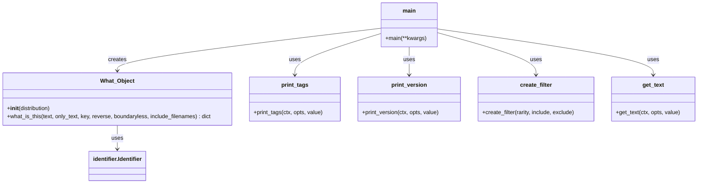

# Milestone 3

Making an easier way to use scripts and install into programs by adding an API wrapper.

## 1. Outline

The goal was to make it easier to implement pyWhat into the pipeline of a script or program that is used for cyber security.

### 1a. The Contribution

### 1b. Report (LaTeX)

Link to report will be published here when done along with sections.

 

---

## SLDC

Brainstorming here before putting into latex for m3.

### Planning

Make our contribution to pyWhat. From Milestone 2 we have:

| Index | Title | Description |
|:-----:|-------|-------------|
| 1     | Non-CLI Usage | Implement a wrapper |
| 2     | Alternative Defaults | Preset Defaults Depending on Usage |
| 3     | Additional Details | Add Output of search for other programs in a pipeline |

 

### Requirements

We need to be able to successfully complete a cycle of input to output through python using pyWhat.

### Design

1. Tech Stack: Python
2. Designed to call directly from the pywhat modules.
3. Create a class that will run a full pywhat scan.
4. Add class methods that directly call to modules like Printer, Identifier , Filter.
5. 

### Implementation

- Version Control: Github
- Github Link:

### Testing

We plan to do unit testing on the functions.
1. Test the wrapper for input validation and sanitation.
2. Test the wrapper for functionality.
3. a

## Conclusion

pyWhat is not actively updated so there is a lot of work to be done. (add more description when complete.)
